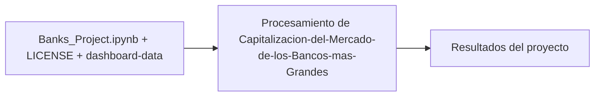

# Capitalización del Mercado de los Bancos más Grandes

## Descripción

Script de Python que aplica **web scraping** para extraer una tabla de datos desde una página web, y luego la procesa mediante un proceso ETL (Extracción, Transformación y Carga) para dejarla lista para su análisis.

## Contenido

- `Banks_Project.ipynb` — notebook con el scraping, la transformación de los datos y la carga del resultado.
- `LICENSE` — Apache License 2.0.

## Diagrama

[Explorar la arquitectura interactiva en GitDiagram](https://gitdiagram.com/HoracioLaphitz/Capitalizacion-del-Mercado-de-los-Bancos-mas-Grandes)



## Tecnologías

Python · Web Scraping · pandas · ETL · Jupyter Notebook

## Cómo ejecutar

```bash
pip install pandas numpy requests beautifulsoup4 jupyter
jupyter notebook Banks_Project.ipynb
```

## Autor

Horacio Laphitz — [GitHub](https://github.com/HoracioLaphitz) · [LinkedIn](https://www.linkedin.com/in/horacio-laphitz)

## Licencia

Apache License 2.0
